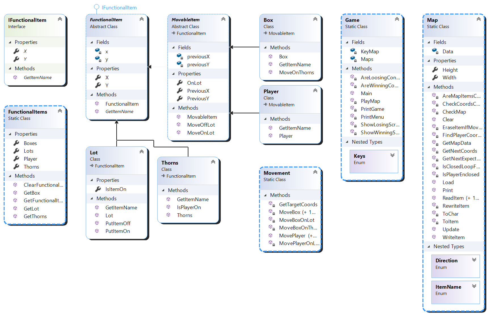

## Sokoban (Exam 1 project)
### Overview
This is a C# project for a game Sokoban, the basic rules of which are:
>The game takes place on a two-dimensional field with a top view. 
>The playing field is divided into squares. A square can be a wall,
>a box, or a player. Also, the square can be a storage for a box.
>The player can move left, right, up and down. But he cannot pass
>through walls and boxes. The player can push the box if it does not
>rest against a wall or other box. The player wins if all the boxes
>are on the storage squares.

The project is a console application that takes input from a user 
as keystrokes. There are 5 different maps available with possibility
to add your own custom maps.

### Requirements
The maps are placed in the `maps` directory and read from it once when
the application is launched. There are rules for maps to be usable:

- it must contain one player and equal amounts of boxes and storage 
places greater that zero;
- the player must be inside a closed loop made of walls;
- the number of characters on each line must be equal.

Every square must be represented by a corresponding character:

- `p` - a player, standing on an empty square;
- `P` - a player, standing on a storage space;
- `o` - a box, placed on an empty square;
- `O` - a box, placed on a storage space;
- `+` - a storage space;
- ` ` - an empty square.

### Functionality
The game menu after the application's launch asks the user to
choose a map and shows how it looks. The menu is controlled by these
keys:

- `LeftArrow` - shows the previous map;
- `RightArrow` - shows the next map;
- `Enter` - chooses the map shown;
- `Escape` - exits the application.

After the map is chosen it is shown again but in a game mode.
The game is controlled by these keys:

- `UpArrow` - moves the player one square up;
- `DownArrow` - moves the player one square down;
- `LeftArrow` - moves the player one square left;
- `RightArrow` - moves the player one square right;
- `Escape` - exits the application.

Of course the controls can't move the player if it's not possible
according to the game rules.

When all the boxes are placed on the storage places the game is won.
If a box is stuck the user can't do anything for now but to exit.

### Architecture

##### Map
Map Class is designed for handling the storage of the map data read 
from a file, for checking its correctness and providing information
about sqaures. It also allows to print a map on a console screen and
change the squares.
##### Movement
Movement Class is designed for handling the movement of the player
and the boxes.
##### ItemClasses
Not every sqaure needs to be represented as an object.

IFunctionalItem is an interface which can be used to create
classes for squares that have functions (thus an object representing
a square needs coordinates and a name).

FunctionalItem is a base class that has a universal constructor
for any object and universal properties for its coordinates.

MovableItem is a base class that adds properties and methods needed
for handling its movement and ability to be placed on a storage space.

Lot, Box and Player classes represent squares that have functions
(unlike walls and empty spaces).

##### FunctionalItems
FunctionalItems Class is designed for storing all the objects on the
current map.

##### Game
Game Class contains an entry point of the application, handles the
game logic and the user interface.
